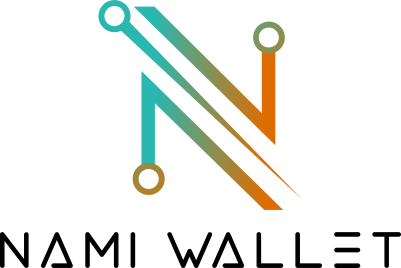

<p align="center"></img></p>

# Nami

Nami is a browser based wallet extension to interact with the Cardano blockchain. It's an open-source project and built by [**Berry Pool**](https://pipool.online).


### Testnet

[Download testnet version](./build.zip)

Extract the zip. Then go to `chrome://extensions`, click Load unpacked at the top left and select the build folder.

### Injected API

Since Nami is a browser extension, it can inject content inside the web context, which means you can connect the wallet to any website.
The exposed API follows [CIP-0030](https://github.com/cardano-foundation/CIPs/tree/master/CIP-0030). The returned types are in `cbor`/`bytes` format. A helpful library for serializing and de-serializing these low-level data structures is the [serialization-lib](https://github.com/Emurgo/cardano-serialization-lib). To verify a signature returned from `cardano.dataSign(address, payload)` the [message-signing](https://github.com/Emurgo/message-signing) library helps.

#### Basic Usage

- Detect the Cardano provider (`window.cardano`) and detect Nami (`window.cardano.nami`)
- Request the `api` from `window.cardano.nami.enable()`
- Detect which Cardano network the user is connected to (ID 1 = Mainnet, ID 0 = Testnet)
- Get the user's Cardano account

#### Methods

The full list of methods can be found in [CIP-0030](https://github.com/cardano-foundation/CIPs/tree/master/CIP-0030).
For the wallet namespace Nami uses `nami`.

**Note:** Nami follows the ongoing [PR](https://github.com/cardano-foundation/CIPs/pull/148) for the `dataSign` endpoint. (Very similar to the previous `dataSign` endpoint from Nami).

Nami also uses a few custom endpoints, which are available under `api.experimental`:

##### api.experimental.getCollateral()

```
cardano.getCollateral() : [TransactionUnspentOutput]
```

##### api.experimental.on(eventName, callback)

Register events coming from Nami. Available events are:

```
accountChange: ((addresses : [BaseAddress]) => void)
networkChange: ((network : number) => void)
```

##### api.experimental.off(eventName, callback)

Deregister the events (works also with anonymous functions).

---

### Injected API (Deprecated)

Since Nami is a browser extension, it can inject content inside the web context, which means you can connect the wallet to any website.
The exposed API follows for most parts this proposed [CIP](https://github.com/cardano-foundation/CIPs/pull/88). The returned types are in `cbor`/`bytes` format. A helpful library for serializing and de-serializing these low-level data structures is the [serialization-lib](https://github.com/Emurgo/cardano-serialization-lib). To verify a signature returned from `cardano.dataSign(address, payload)` the [message-signing](https://github.com/Emurgo/message-signing) library helps.

#### Basic Usage

- Detect the Cardano provider (`window.cardano`)
- Detect which Cardano network the user is connected to (ID 1 = Mainnet, ID 0 = Testnet)
- Get the user's Cardano account

#### Methods

**All methods will return their values as `Promise`. For simplicity and easier understanding the API is explained without the Promises.**

##### cardano.enable()

Will ask the user to give access to requested website. If access is given, this function will return `true`, otherwise throws an `error`.
If the user calls this function again with already having permission to the requested website, it will simply return `true`.

##### cardano.isEnabled()

```
cardano.isEnabled() : boolean
```

Returns `true` if wallet has access to requested website, `false` otherwise.

##### cardano.getBalance()

```
cardano.getBalance() : Value
```

`Value` is a hex encoded cbor string.

##### cardano.getUtxos(amount, paginate)

```
cardano.getUtxos(amount?: Value, paginate?: {page: number, limit: number}) : [TransactionUnspentOutput]
```

`TransactionUnspentOutput` is a hex encoded bytes string.

`amount` and `paginate` are optional parameters. They are meant to filter the overall utxo set of a user's wallet.

##### cardano.getCollateral()

```
cardano.getCollateral() : [TransactionUnspentOutput]
```

##### cardano.getUsedAddresses()

```
cardano.getUsedAddresses() : [BaseAddress]
```

`BaseAddress` is a hex encoded bytes string.

**Note** Nami doesn't utilize the concept of multipe addresses per wallet. This function will return an array of length `1` and will always return the same single address. Just to follow the standards of the proposed [CIP](https://github.com/cardano-foundation/CIPs/pull/88), it will return the address in an array.

##### cardano.getUnusedAddresses()

```
cardano.getUnusedAddresses() : [BaseAddress]
```

**Note** This endpoint will return an empty array []. Same reason as above, simply to follow the standards.

##### cardano.getChangeAddress()

```
cardano.getChangeAddress() : BaseAddress
```

Will return the same address as the one in `cardano.getUsedAddresses()`.

##### cardano.getRewardAddress()

```
cardano.getRewardAddress() : [RewardAddress]
```

`RewardAddress` is a hex encoded bytes string.

**Note** This function will return an array of length `1` and will always return the same single address.

##### cardano.getNetworkId()

```
cardano.getNetworkId() : number
```

Returns `0` if on `testnet`, otherwise `1` if on `mainnet`.

##### cardano.signData(address, payload)

```
cardano.signData(address: BaseAddress|RewardAddress, payload: string) : CoseSign1
```

`payload` is a hex encoded utf8 string.
`CoseSign1` is a hex encoded bytes string.

If address is the `BaseAddress` the signature is returned with the `Payment Credential`, otherwise if the address is the `RewardAddress` the signature is returned with the `Stake Credential`.

The returned `CoseSign1` object contains the `payload`, `signature` and the following protected headers:

- `key_id` => `PublicKey`,
- `address` => `BaseAddress | RewardAddress`
- `algorithm_id` => EdDSA(0) (the algorithm used for Cardano addresses).

Read more about message signing in [CIP-0008](https://github.com/cardano-foundation/CIPs/blob/master/CIP-0008/CIP-0008.md).

##### cardano.signTx(tx, partialSign)

```
cardano.signTx(tx: Transaction, partialSign?: boolean) : TransactionWitnessSet
```

`Transaction` is a hex encoded cbor string.
`TransactionWitnessSet` is a hex encoded cbor string.

`partialSign` is by default `false` and optional. The wallet needs to provide all required signatures. If it can't an `error` is thrown, otherwise the `TransactionWitnessSet` is returned.

If `partialSign` is `true`, the wallet doesn't need to provide all required signatures.

##### cardano.submitTx(tx)

```
cardano.submitTx(tx : Transaction) : hash32
```

Returns the transaction hash, if transaction was submitted successfully, otherwise throws an `error`.

#### Events

##### cardano.onAccountChange(addresses)

```
cardano.onAccountChange((addresses : [BaseAddress]) => void)
```

**Note** To follow the standards of multiple addresses the callback will return an array, although Nami will just return an array with a single address, which is the same as the one in `cardano.getUsedAddresses()`.

##### cardano.onNetworkChange(network)

```
cardano.onNetworkChange((network : number) => void)
```

---

### Develop

The `project_id` for API requests can be created under [blockfrost.io](https://blockfrost.io/).

**Recommended:** Follow this [approach](https://github.com/lxieyang/chrome-extension-boilerplate-react#secrets) in order to keep the keys seperate from the repository.

The quick solution is to go under `./src/config/provider.js` and replace `secrets.PROJECT_ID_MAINNET` and `secrets.PROJECT_ID_TESTNET` with the project ids from blockfrost.

##### Requirements

- Node.js 14

##### Start development server

```
npm start
```

##### Create production build

```
npm run build
```

##### Run tests

```
npm test
```

### Additional

[Wasm packages](./src/wasm/) commit hash: [0d513ff8b81a7bfac04fc06258731740c1b7a4d9](https://github.com/spacebudz/lucid)

### Website

Visit [namiwallet.io](https://namiwallet.io)<br/>
Visit [Berry Pool](https://pipool.online)
